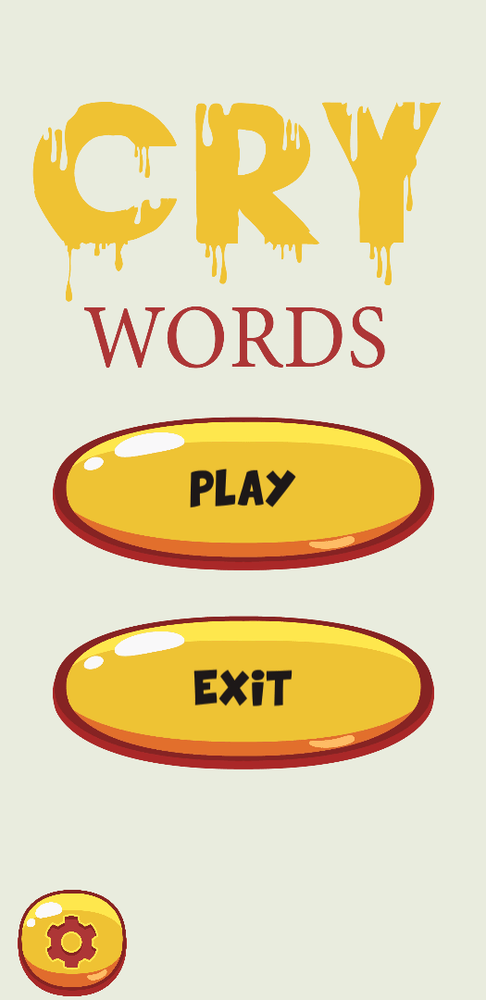

# Cry Words

**Introduction**
---
>You will see the puzzle game. I made for my university graduation project.
* 

---
## **Genaral Information**
* My game has a large word pool from 10 different categories and 10 levels in each category.
* All  UI Design in the game are completely mine.
* I coded a custom editor while developing the game. In this way, I was able to manage the game more easily.

---
 
  
 
---
 
  

---

### **Conclusion**

* I'm still developing my game. I want to add multiplayer mode and different game modes. 
* Thank you for reading.

